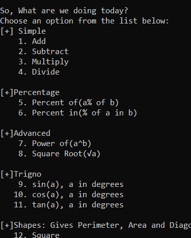

# Advanced Calculator
Run on Replit.com: [advanced-calc](https://replit.com/join/gbglzygz-mightykillrr1)
### About this program
This is a small yet feature-rich calculator. This can:

#### [-] Simple
  [+] Add\
  [+] Subtract\
  [+] Multiply\
  [+] Divide\
  [+] Mixed(soon)
 
#### [-] Advanced
  [+] Percentage problems\
  [+] Power of\
  [+] Square Roots\
  [+] sin()\
  [+] cos()\
  [+] tan()
  
#### [-] Shapes: Gives perimeter, area and diagonal/diameter and more:
  [+] Square\
  [+] Rectangle\
  [+] Circle\
  [+] Pentagon(Soon)\
  [+] Hexagon(Soon)
  
  ###### Preview:

 
  #### Known bugs:
   -copy to clipboard function doesn't work on Replit

> *This project was made as a fun practice project during my Python learning course. I hope you guys like it. Do report any bugs or suggestions!*
